# IT Support - Windows VM Practice

Dự án thực hành thiết lập, cấu hình và quản trị máy ảo Windows 10 nhằm mô phỏng quy trình bàn giao máy tính cho nhân viên trong môi trường doanh nghiệp.

## Công cụ sử dụng
- VMware Workstation Pro 15.5
- Windows 10 x64 (Education/Professional)
- Microsoft Office 365

# IT Support - Windows VM Practice

Dự án thực hành thiết lập, cấu hình và quản trị máy ảo Windows 10 nhằm mô phỏng quy trình bàn giao máy tính cho nhân viên trong môi trường doanh nghiệp.

## Công cụ sử dụng
- VMware Workstation Pro 15.5
- Windows 10 x64 (Education/Professional)
- Microsoft Office 365

## Nội dung thực hành

### 1. Thiết lập máy ảo
- Triển khai một máy tính hoàn chỉnh từ đầu — mô phỏng đúng quy trình chuẩn bị máy mới cho nhân viên trong doanh nghiệp, từ khâu khởi tạo phần cứng ảo đến cài đặt hệ điều hành:
- Khởi tạo máy ảo trên VMware Workstation, lựa chọn cấu hình phù hợp với nhu cầu sử dụng thực tế
- Tính toán và phân bổ tài nguyên hợp lý: RAM 8GB, CPU 4 processor x 2 core, ổ cứng 256GB — đảm bảo máy vận hành ổn định, không lãng phí tài nguyên
- Cài đặt hệ điều hành Windows 10 x64 từ file ISO, theo dõi và xử lý toàn bộ quá trình cho tới khi máy sẵn sàng sử dụng

  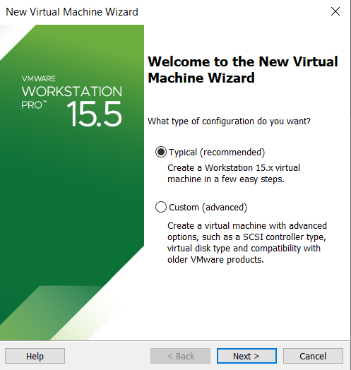
*Khởi tạo máy ảo mới, chọn cấu hình Typical*

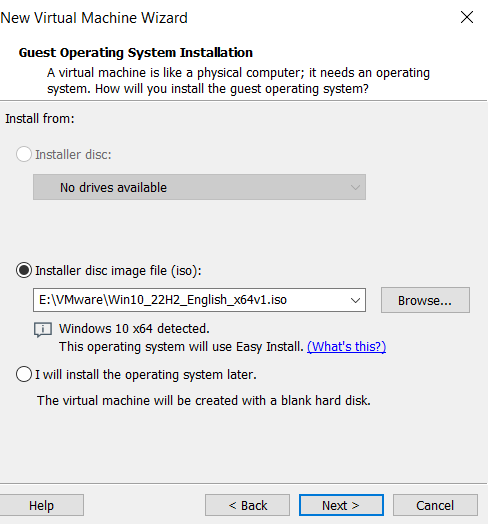
*Gắn file ISO Windows 10 x64 để cài đặt hệ điều hành*

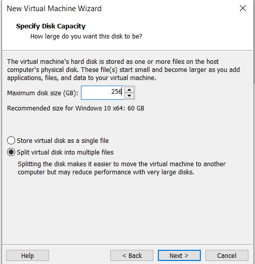
*Thiết lập dung lượng ổ đĩa 256GB*

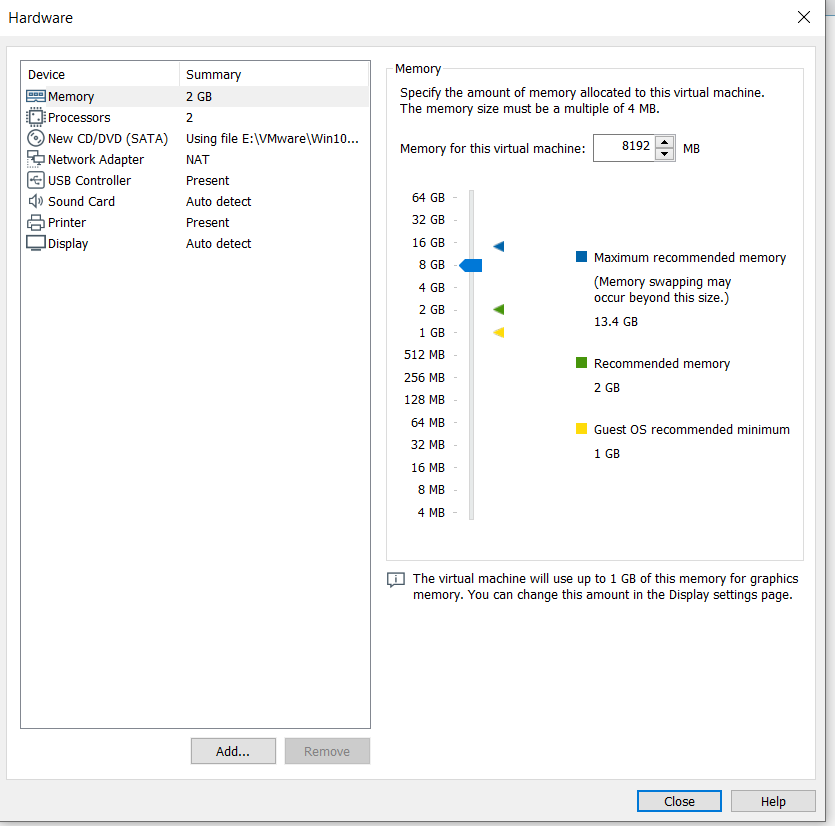
*Cấu hình RAM 8GB*

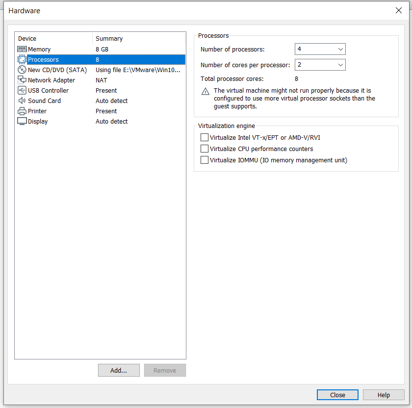
*Cấu hình CPU 4 processor x 2 core*

Sau khi hoàn tất cấu hình phần cứng, tiến hành cài đặt và theo dõi toàn bộ quá trình thiết lập hệ điều hành:

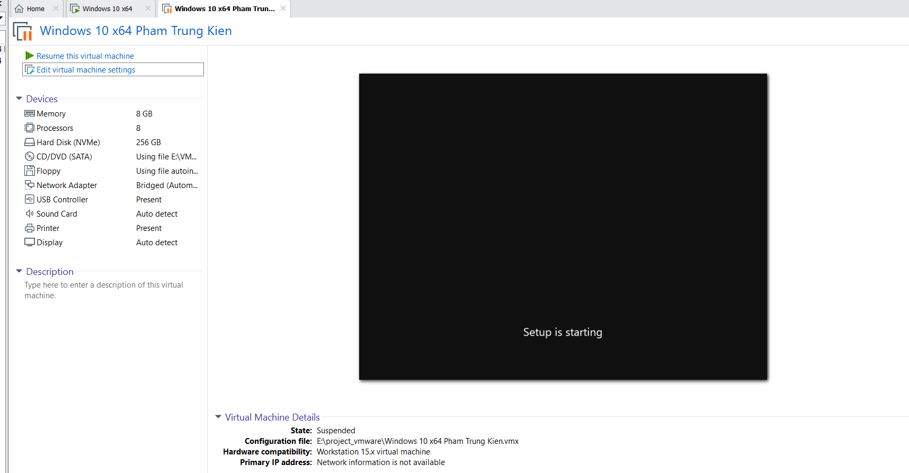
*Windows đang được cài đặt*

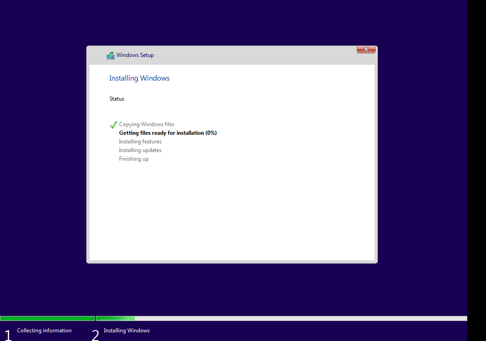
*Hệ thống chuẩn bị khởi động lần đầu*

*Setup Windows đang khởi tạo*

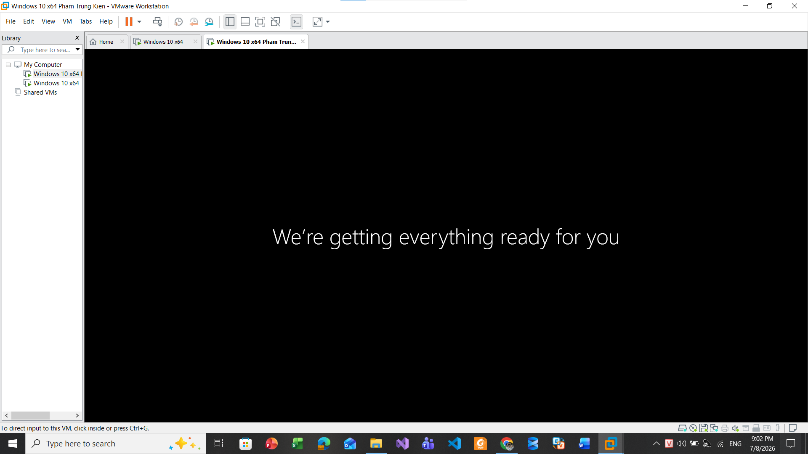
*Hoàn tất — máy ảo sẵn sàng bàn giao và sử dụng*

### 2. Chia phân vùng ổ cứng
Ngay sau khi cài đặt xong Windows, tiến hành chia ổ đĩa để tách ổ hệ thống (C) và ổ lưu trữ dữ liệu (E),tránh mất dữ liệu khi cần cài lại hệ điều hành sau này.
Dùng Disk Management để thu nhỏ (Shrink) một phần dung lượng ổ C.
Tạo vùng trống, sau đó tạo phân vùng mới, format NTFS và gán ký tự ổ đĩa.

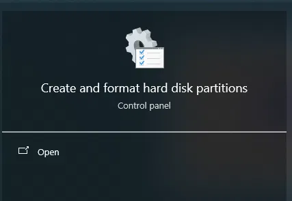
*Mở công cụ Disk Management*

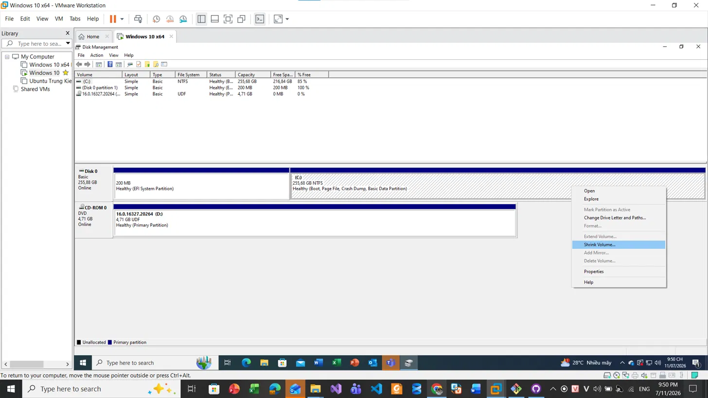
*Shrink Volume để tạo vùng trống từ ổ C*

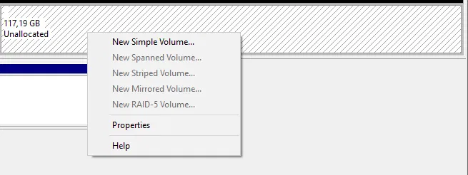
*Tạo phân vùng mới (New Simple Volume)*

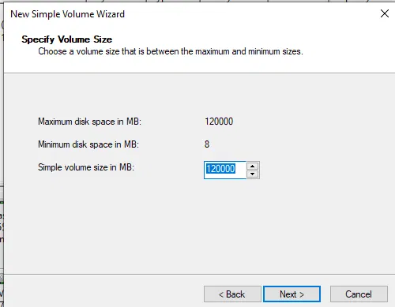
*Thiết lập dung lượng phân vùng mới*

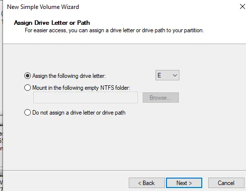
*Gán ký tự ổ đĩa (E)*

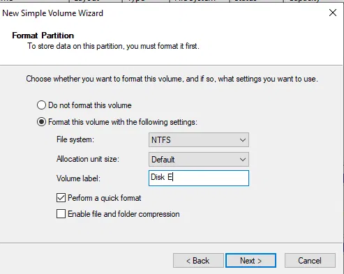
*Format phân vùng theo chuẩn NTFS*

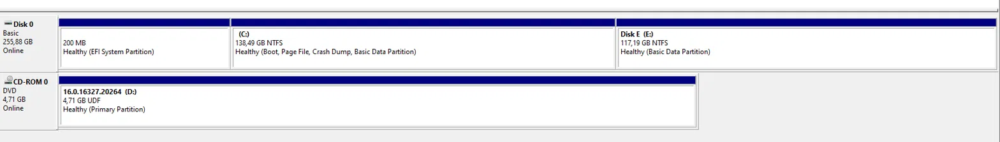
*Kết quả: ổ C (hệ thống) và ổ E (dữ liệu) đã tách biệt hoàn chỉnh*

### 3. Kiểm tra hệ thống và giám sát hiệu năng
- Kiểm tra thông tin phần cứng và hệ điều hành bằng công cụ DXDiag
- Xác minh cấu hình mạng (địa chỉ IP, gateway) bằng lệnh `ipconfig` trong Command Prompt
- Giám sát hiệu năng ổ đĩa (Disk) và bộ nhớ (Memory) bằng Resource Monitor, giúp phát hiện sớm nếu có tiến trình chiếm dụng tài nguyên bất thường

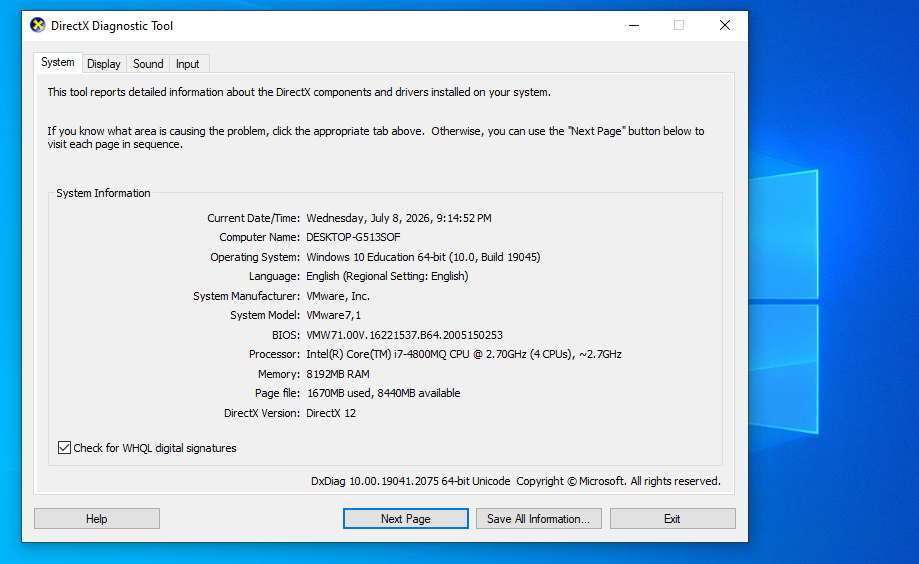
*Kiểm tra thông tin phần cứng và hệ điều hành bằng DXDiag*

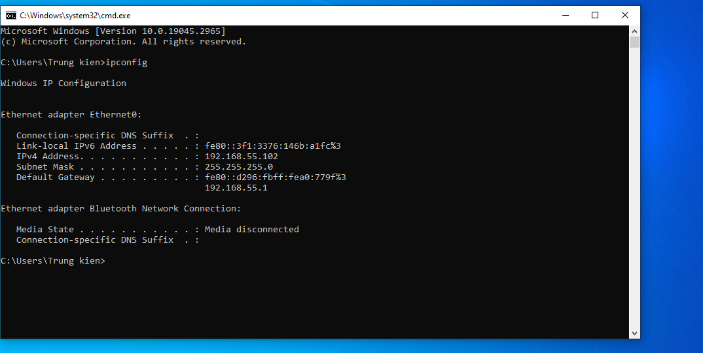
*Xác minh địa chỉ IP, gateway bằng lệnh ipconfig*

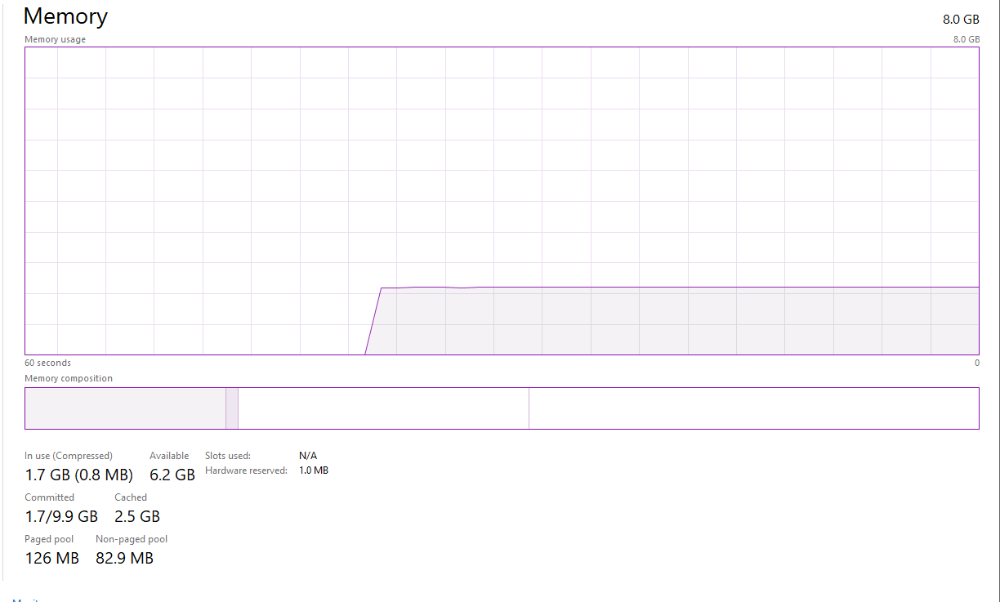
*Giám sát hiệu năng bộ nhớ (Memory) qua Resource Monitor*

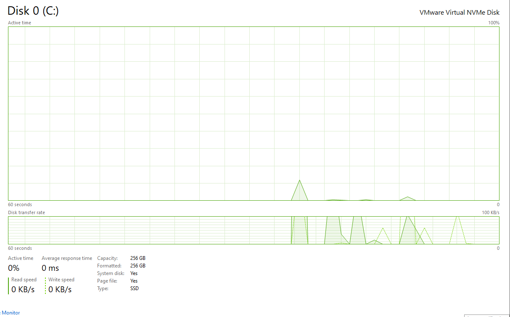
*Giám sát hiệu năng ổ đĩa (Disk) qua Resource Monitor*
Bạn dán đè đúng 3 mục này vào README (giữ nguyên mục 4, 5 đã có), rồi Commit changes là hoàn tất toàn bộ.Cette conversation contient 88 images sur 100 (pages PDF incluses). Envisagez de démarrer une nouvelle conversa

### 4. Cài đặt Microsoft Office
Thực hiện quy trình chuẩn bị phần mềm văn phòng cho máy tính trước khi bàn giao — một trong những tác vụ phổ biến nhất của IT Support khi setup máy mới cho nhân viên:
- Gắn file ISO Office vào ổ đĩa ảo (CD/DVD) của máy tính
- Kiểm tra và xác nhận ổ đĩa đã nhận diện đúng file cài đặt
- Chạy file Setup, giám sát quá trình tải và cài đặt bộ ứng dụng Word, Excel, PowerPoint, Outlook, Teams...
- Đảm bảo Office được cài đặt hoàn chỉnh, sẵn sàng sử dụng ngay khi bàn giao cho người dùng

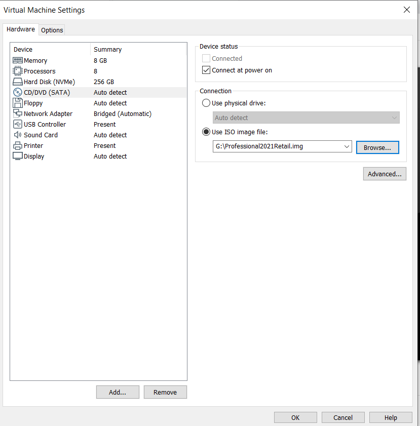
 *Cấu hình VM Settings, gắn file ISO Office vào ổ đĩa ảo*

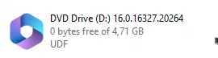
 *Ổ đĩa DVD đã nhận diện file cài đặt*

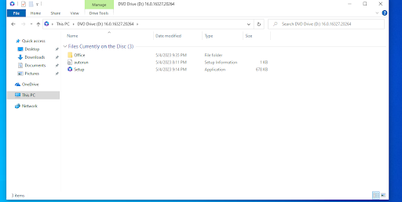
 *Danh sách file cài đặt trên ổ đĩa (Setup, Office)*

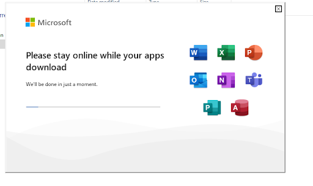
 *Bộ ứng dụng Word, Excel, PowerPoint... đang được tải và cài đặt*

### 5. Tạo tài khoản và phân quyền người dùng
Đây là kỹ năng cốt lõi mà bất kỳ IT Support nào cũng cần thành thạo — cấp tài khoản đúng chuẩn và kiểm soát chặt chẽ quyền truy cập dữ liệu, tránh rủi ro bảo mật khi bàn giao máy cho nhân viên mới:
- Tạo tài khoản người dùng mới trong Computer Management, đặt mật khẩu và cấu hình yêu cầu đổi mật khẩu ở lần đăng nhập đầu tiên — đảm bảo tuân thủ quy trình bảo mật cơ bản
- Kiểm tra thực tế bằng cách đăng nhập lại với tài khoản vừa tạo, xác nhận hệ thống hoạt động đúng như thiết kế
- Thiết lập phân quyền NTFS cho thư mục dùng chung, chỉ cấp quyền Read & Execute — giới hạn đúng mức cần thiết, không cho phép chỉnh sửa/xóa ngoài ý muốn
- Xử lý tình huống thực tế phức tạp hơn: một thư mục có sẵn nhiều quyền kế thừa từ thư mục cha, cần chủ động ngắt kế thừa (Block Inheritance) để chỉ giữ lại đúng những quyền cần thiết, đảm bảo không ai ngoài phạm vi được phép vẫn truy cập được

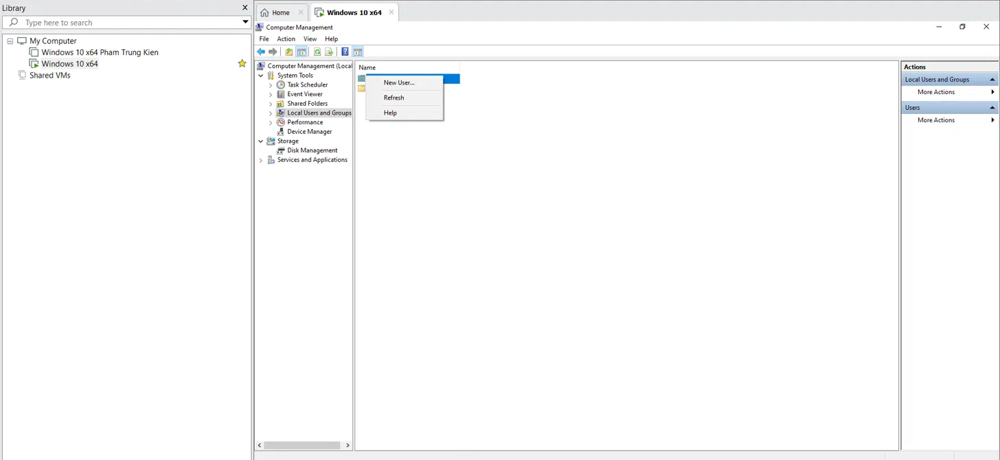
*Mở Computer Management để quản lý tài khoản người dùng*

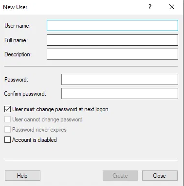
*Khởi tạo hộp thoại New User*

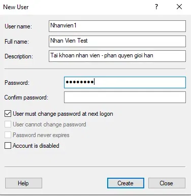
*Điền thông tin tài khoản, đặt mật khẩu và yêu cầu đổi mật khẩu lần đầu đăng nhập*

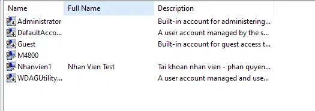
*Tài khoản "Nhanvien1" đã được tạo thành công trong hệ thống*

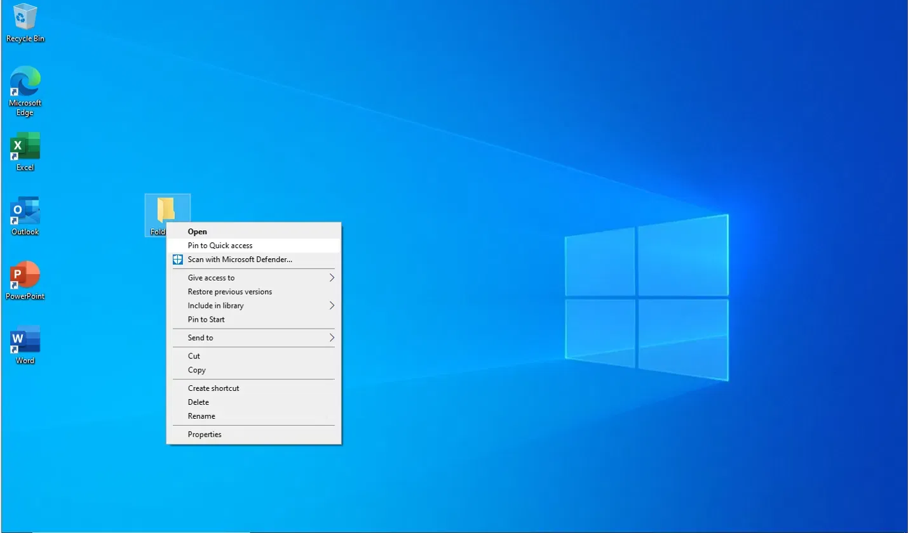
*Kiểm tra thực tế: đăng nhập lần đầu bằng tài khoản vừa tạo*

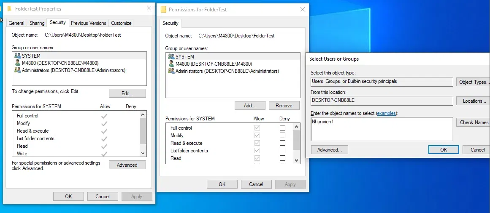
*Kiểm tra quyền hạn ban đầu của thư mục dùng chung*

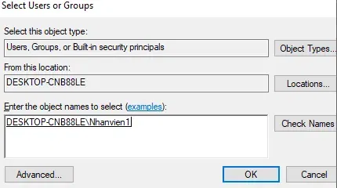
*Tìm và thêm chính xác tài khoản vào danh sách phân quyền*

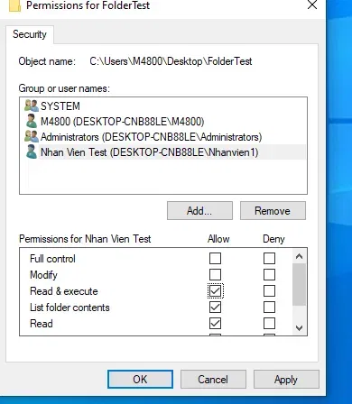
*Cấp quyền Read & Execute — giới hạn đúng mức, không cho phép chỉnh sửa*

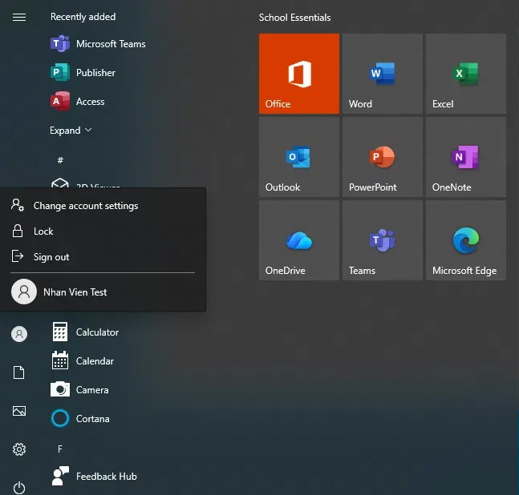
*Xác minh quyền truy cập ứng dụng bằng tài khoản vừa phân quyền*

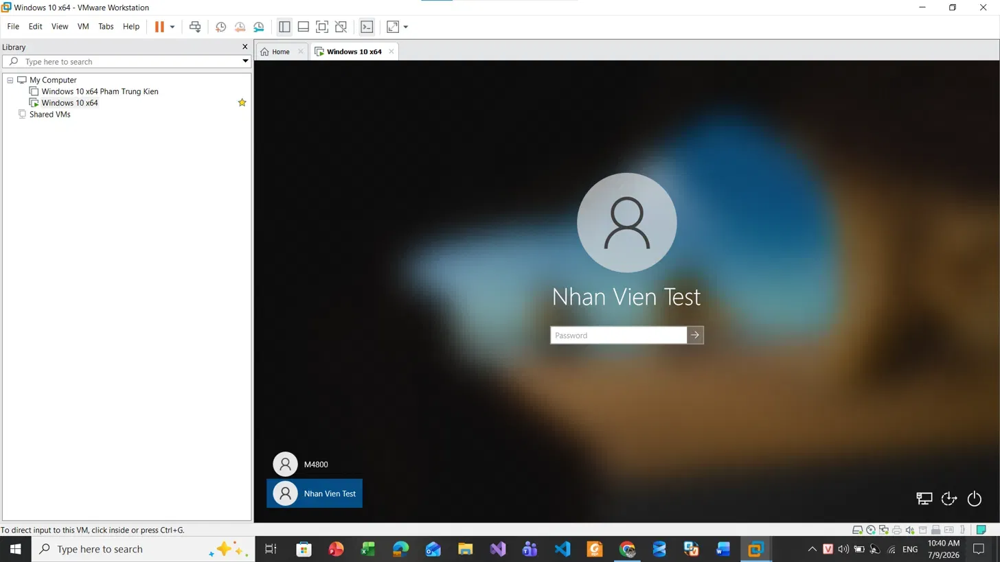
*Kiểm tra lại màn hình đăng nhập, đảm bảo tài khoản hoạt động ổn định*

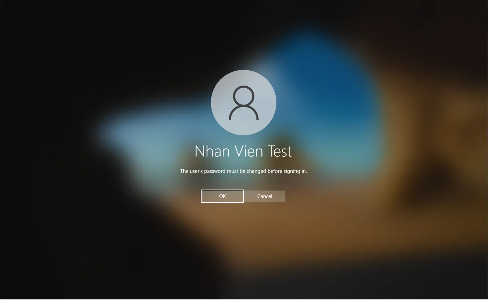
*Xác nhận toàn bộ quy trình đăng nhập diễn ra chính xác*

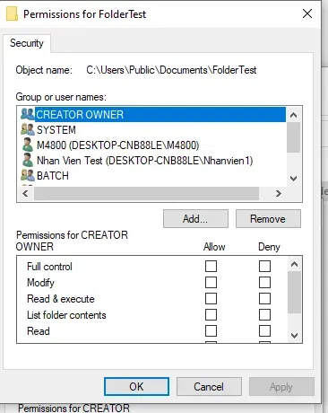
*Phát hiện thư mục Public Documents có nhiều quyền kế thừa phức tạp cần xử lý*

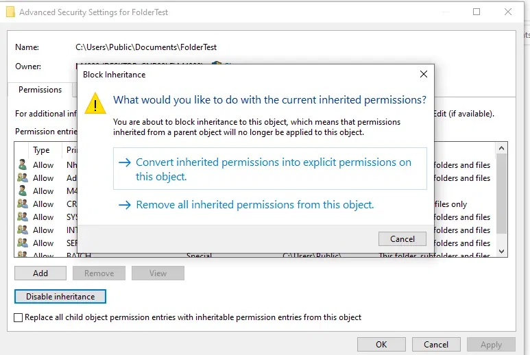
*Chủ động ngắt kế thừa quyền (Block Inheritance) để kiểm soát chính xác*

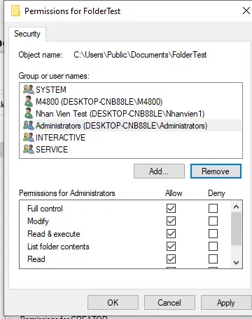
*Danh sách quyền sau khi xử lý — chỉ giữ lại đúng những gì cần thiết*

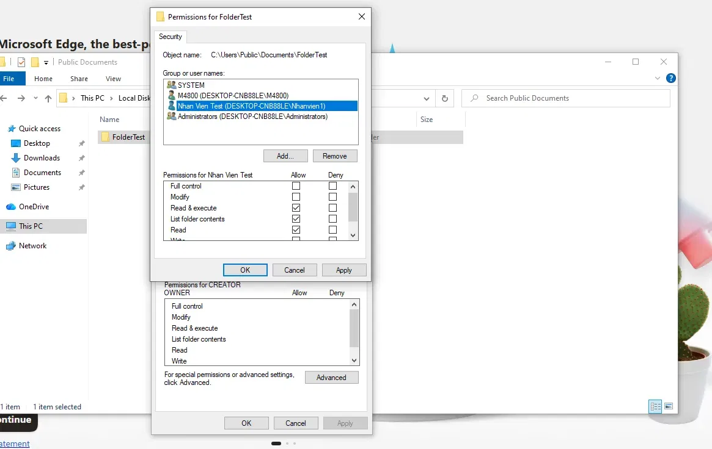
*Kiểm tra lại giao diện và quyền truy cập sau khi cấu hình*

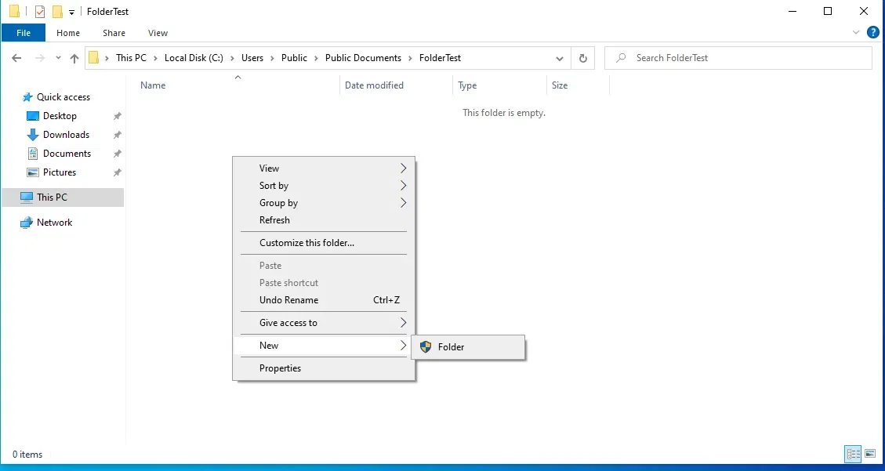
*Xác minh kết quả phân quyền qua File Explorer*

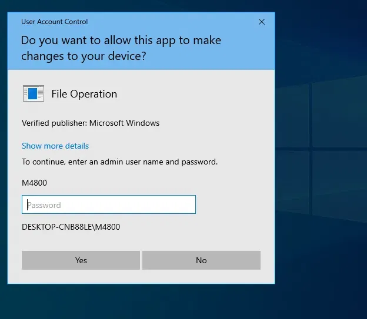
*Xác nhận quyền quản trị (UAC) khi thực hiện thay đổi hệ thống*

## Kỹ năng đạt được
- Triển khai và cấu hình máy ảo Windows**: Cấu hình tài nguyên (RAM, CPU, ổ cứng) phù hợp với nhu cầu sử dụng, đảm bảo hệ thống vận hành ổn định
- Quản lý phân vùng ổ đĩa: Sử dụng Disk Management để tách ổ hệ thống và ổ dữ liệu, giảm rủi ro mất dữ liệu khi cần cài lại hệ điều hành
- Cấu hình và chẩn đoán mạng cơ bản: Xác minh kết nối mạng, địa chỉ IP, gateway bằng CMD (ipconfig), đảm bảo máy sẵn sàng kết nối trước khi bàn giao
- Cài đặt hệ điều hành và phần mềm văn phòng: Cài đặt Windows, Microsoft Office từ ISO, xử lý toàn bộ quy trình chuẩn bị máy cho người dùng
- Quản trị tài khoản người dùng và phân quyền NTFS: Tạo tài khoản, cấu hình phân quyền cơ bản và xử lý các tình huống phân quyền nâng cao (kế thừa quyền, bảo mật thư mục dùng chung)
- Giám sát hiệu năng hệ thống: Sử dụng Resource Monitor, DXDiag để theo dõi và chẩn đoán hiệu năng CPU/RAM/Disk, phát hiện sớm sự cố tiềm ẩn

---

